# Upper Hand Poker Trainer
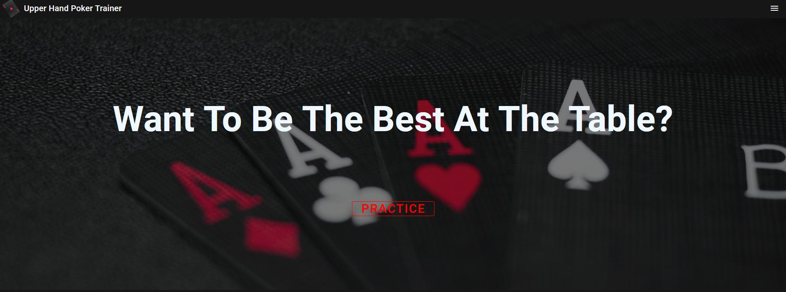
## A TCD Project

Upper Hand Poker Trainer is a website developed for a Group Software Engineering Project in Trinity College Dublin by Brian Farrell, Matthew Howard, Cornell Cicai, John Cosgrove and Will Robbins. 

The purpose of this project is to provide users a platform to improve their knowledge and understanding of the game of "Poker" by playing a series of Scenarios designed to teach fundamentals of the game. 

Users are presented with a Poker table that could be anywhere from the very beginning of the game to the last turn. They are provided information about the current state of the game and decisions made by the other players at the table.

The player must then make a decision based on all available information, if this decision is correct the player will gain rating and move up the leaderboard. Otherwise they will be given a justification as to why they were wrong that they can hopefully use to make better decisions in the future.

# Features
## The Home Page
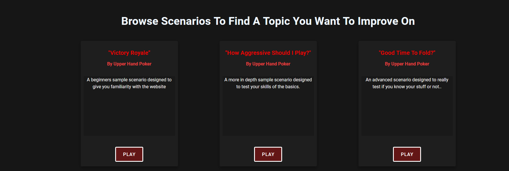

The first feature presented to the user on the Home Page is a selection of Scenarios designed to teach the basic idea of the project. These are handpicked Scenarios that are relatively easy and give the user a chance to practice and become familiar with the Scenarios in a low-risk environment.

Users can simply click on the "Play" button of the Scenario they would like to play and they will be redirected to the page.

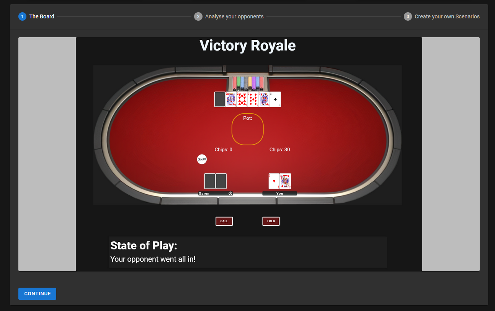

The second feature is the Tutorial Stepper which provides the user with a basic guide of how to use the website. It allows you to see what Scenarios will look like before you play one so you know what to expect.

## Scenarios

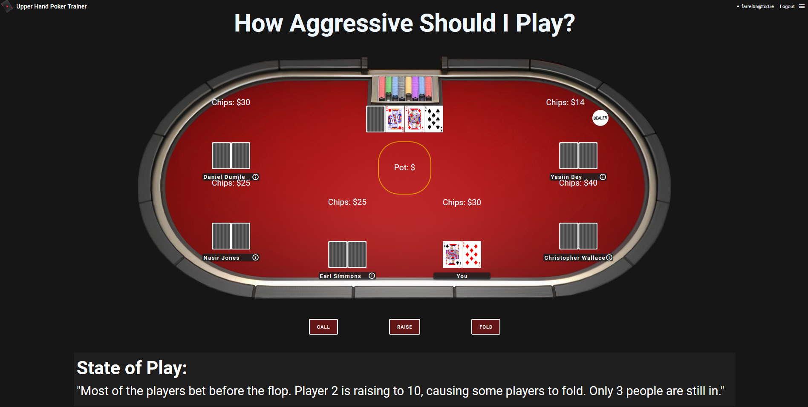

The purpose of this project is to help users improve their understanding of Poker, this is done via the main features known as "Scenarios". Scenarios are premade Poker games where the user is dropped into the table mid-game, they are presented with their hand and some information about the current State Of Play and some information about their opponents. 

They must then make a decision about what move to make, once a user makes a decision they will be provided with feedback telling them wheter or not they were correct and why. 

A rating is calculated based on the decision made and added to the users overal rating. By playing through the Scenarios provided along with custom user submitted Scenarios the user should see an improvement in their knowledge and decisions.

### Opponet Information
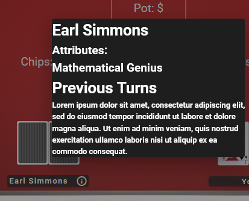

If the user clicks on the name of any of the other players at the table they will be presented with a pop-up. This gives them the attributes and previous moves of this opponenet. 

This information should be used to make an informed decision as it will influence wich decision is the correct one.

### Raise Options
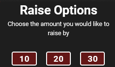

If the user goes to raise they will be presented with several options as raising is not a binary decision. 

### Result
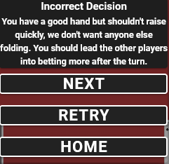

At the end of the Scenario the user is told if the decision they made was right or wrong and is provided with some justification for this. This informatio should be used to improve their future decisions.

## User Accounts
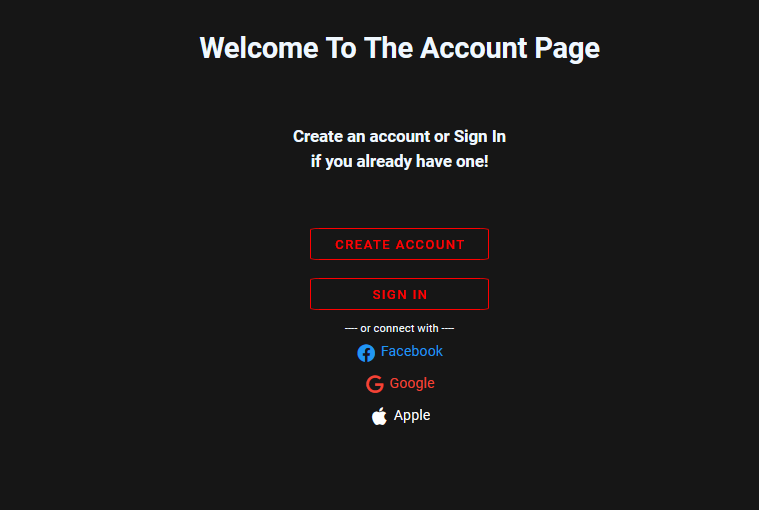

The next important feautre is user accounts. Users will need an account if they want to track their stats and also contribute Scenarios of their own to the site.

When the user navigates to the Account page they can create an account if they don't have one or Log In to a pre-existing account.

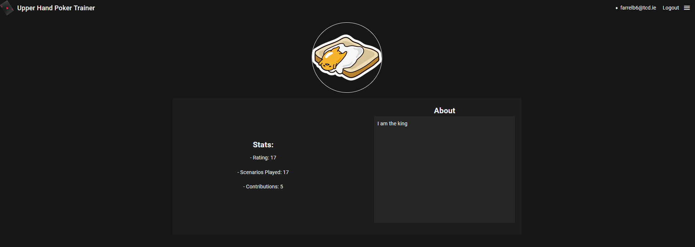

Once Logged in users will be re-directed to their Profile Page where they can see their current stats as well as a little bit of personal information. Users can navigate to any other account by appending their email address to the end of the 
/profile URL

Once logged in the users Nav Bar will display their email address and a button allowing them to log out from anywhere. Clicking their email will bring them back to their Profile Page

## Scenario Browser
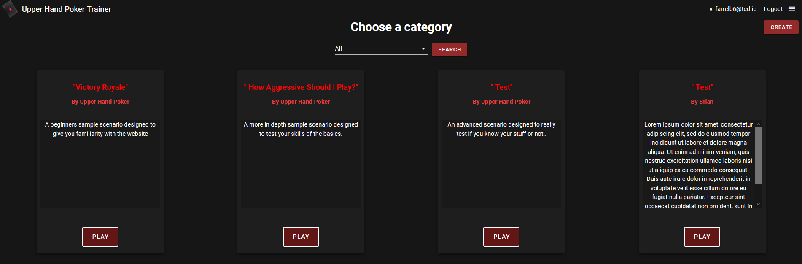

The Scenario Browser is the most important feature and page of the website. Here the user is presented with a grid of Scenario Cards, the website will generate a card for every single Scenario in the Database. This allows the user to see all of the available Scenarios and choose the exact ones they want to play. Once the user has found a Scenario they want to play they simply click the "Play" button and they will be re-directed to the Scenario page with the Scenario loaded.

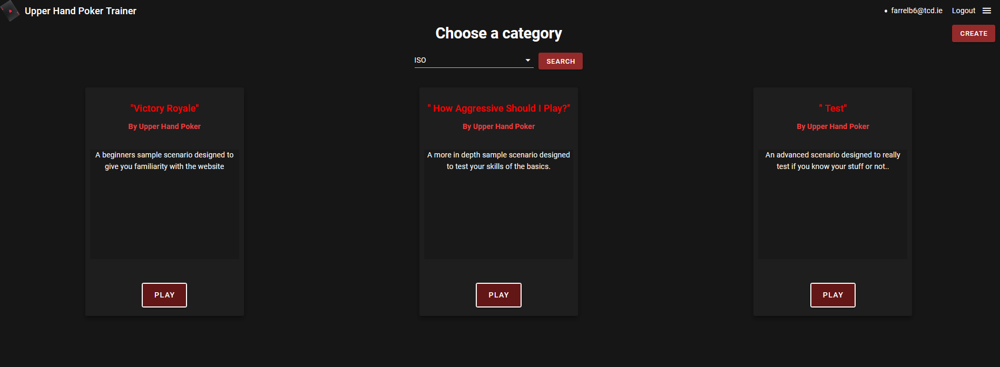

If the user is looking to play a specific type of Scenario they can use the "Categories" drop down menu to select the type of Scenario they would like to play. Once they have choosen a category they simply press "Search" and the page updates and presents them will all Scenarios of that type.

## Scenario Creation

If a user is Logged In and of high enough privilege they are presented with the "Create" button on the Scenario Browser Page. This button allows them to create their own custom Scenarios to be added to the collection. When the user presses this button they will be presented with a form to fill out. This form prompts them to enter all the information neccesarry for a Scenario and ensures this information is correct and will be accepted by the Database.

## Leaderboard
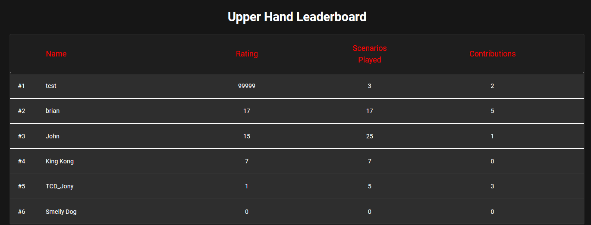

The final page of the project is the Leaderboard, here users can see a list of the Top Users of the Website. Users are ordered by their total Rating as determined by the decisions they make during the Scenarios. Each user can be clicked on to go to their Profile Page.

## Implementation

The project is implemented entirely using Vuejs and Firebase.

# Vue
Vuejs is a front-end JavaScript framework for building user interfaces and single-page applications.

# Firebase
Firebase is a Google platform that we used to implement our database and user authentication.

Scenarios are stored in the database as a collection of documents, each scenario is its own unique document with an ID. Each Scenario has fields corresponding to the information neccessary to render it correctly. 

User account data is stored in the "users" collection, when a user registers a new account a document is created using their email that ties their details to the account.

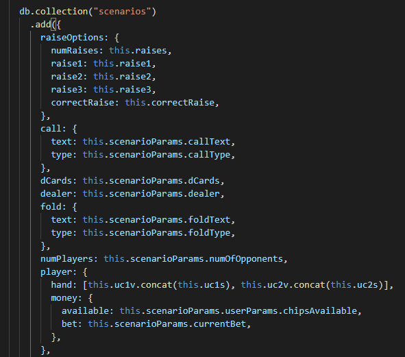
When a user creates a Scenario using the website the data is formated and sent to the database as a new Scenario.

